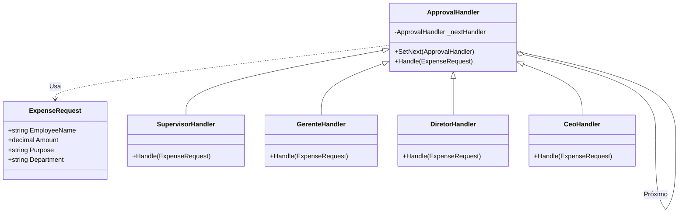

## 🥁 CarnaCode 2026 - Desafio 13 - Chain of Responsibility

Oi, eu sou o Ronaldo e este é o espaço onde compartilho minha jornada de aprendizado durante o desafio **CarnaCode 2026**, realizado pelo [balta.io](https://balta.io). 👻

Aqui você vai encontrar projetos, exercícios e códigos que estou desenvolvendo durante o desafio. O objetivo é colocar a mão na massa, testar ideias e registrar minha evolução no mundo da tecnologia.

### Sobre este desafio
No desafio **Chain of Responsibility** eu tive que resolver um problema real implementando o **Design Pattern** em questão.
Neste processo eu aprendi:
* ✅ Boas Práticas de Software
* ✅ Código Limpo
* ✅ SOLID
* ✅ Design Patterns (Padrões de Projeto)


## Problema
Uma empresa precisa processar pedidos de reembolso com diferentes níveis de aprovação baseados no valor. 
O código atual usa condicionais gigantes e está difícil de manter quando novos níveis de aprovação são adicionados.

## Solução: Chain of Responsibility

### Sobre o Padrão
O **Chain of Responsibility** (Cadeia de Responsabilidade) é um padrão comportamental que permite passar pedidos por uma corrente de handlers. Ao receber um pedido, cada handler decide se o processa ou o passa para o próximo handler da corrente.

Isso desacopla o remetente de quem realmente processa o pedido, permitindo que múltiplos objetos tenham a chance de tratar a requisição.

### Diagrama de Classes


### Estrutura de Arquivos
```
src
├── ApprovalHandler.cs      # Classe base abstrata
├── CeoHandler.cs          # Handler para > R$ 5.000
├── Challenge.cs           # Código legado (original)
├── ChainOfResponsibility.csproj
├── DiretorHandler.cs      # Handler até R$ 5.000
├── ExpenseRequest.cs      # Modelo de dados
├── GerenteHandler.cs      # Handler até R$ 500
├── Program.cs             # Ponto de entrada e configuração da cadeia
└── SupervisorHandler.cs   # Handler até R$ 100
```

### Etapas da Refatoração
1.  **Extração do Modelo**: Separação da classe `ExpenseRequest` do código monolítico original.
2.  **Criação da Abstração**: Definição da classe base `ApprovalHandler` com a lógica de encadeamento (`SetNext` e `Handle`).
3.  **Implementação dos Handlers**: Criação das classes concretas (`Supervisor`, `Gerente`, `Diretor`, `CEO`), movendo a lógica condicional de cada nível para sua respectiva classe.
4.  **Configuração da Cadeia**: No `Program.cs`, as instâncias foram criadas e conectadas sequencialmente.
5.  **Execução**: O cliente envia o pedido apenas para o primeiro item da cadeia (Supervisor), que propaga conforme necessário.

## Sobre o CarnaCode 2026
O desafio **CarnaCode 2026** consiste em implementar todos os 23 padrões de projeto (Design Patterns) em cenários reais. Durante os 23 desafios desta jornada, os participantes são submetidos ao aprendizado e prática na idetinficação de códigos não escaláveis e na solução de problemas utilizando padrões de mercado.

### eBook - Fundamentos dos Design Patterns
Minha principal fonte de conhecimento durante o desafio foi o eBook gratuito [Fundamentos dos Design Patterns](https://lp.balta.io/ebook-fundamentos-design-patterns).

### Veja meu progresso no desafio
[Repositório central](https://github.com/ronaldofas/balta-desafio-carnacode-2026-central)
